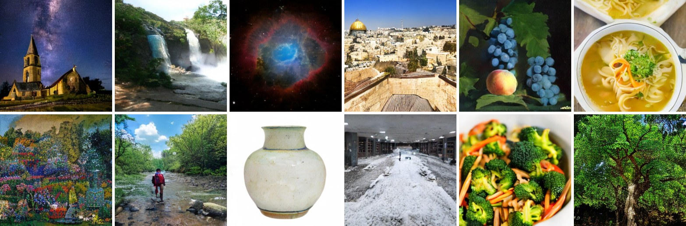
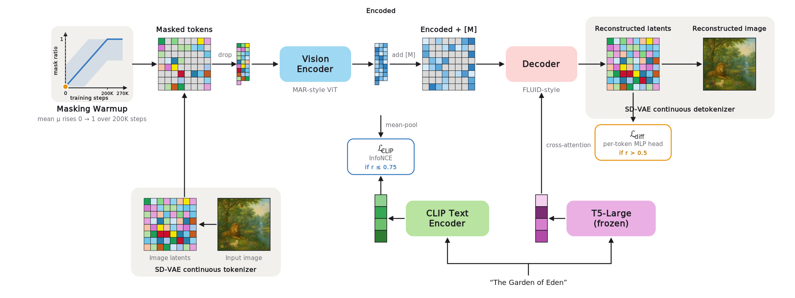
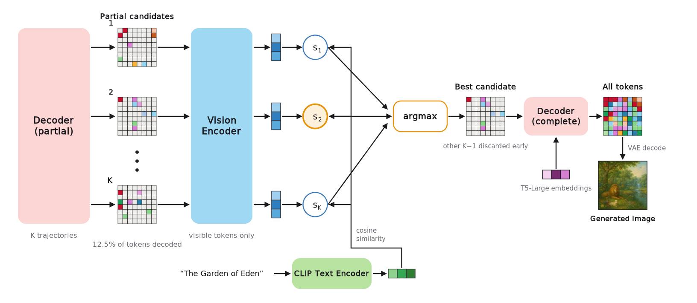
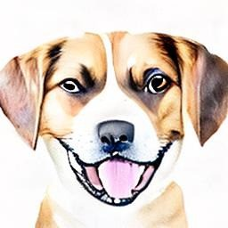
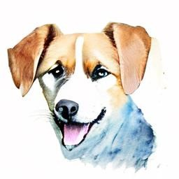

<div align="center">

# DREAM

### Unifying Contrastive and Generative Objectives for Visual Understanding and Text-to-Image Generation

**NeurIPS 2026**

[](https://arxiv.org/abs/2603.02667)
[](https://chaoli-charlie.github.io/dream/)
[](https://pytorch.org/)
[](LICENSE)

[Chao Li](https://chaoli-charlie.github.io/)<sup>1*</sup>, [Tianhong Li](https://www.tianhongli.me/)<sup>1</sup>, Sai Vidyaranya Nuthalapati<sup>2</sup>, [Hong-You Chen](https://sites.google.com/view/hongyouc/about-me)<sup>2</sup>, [Satya Narayan Shukla](https://satyanshukla.github.io/)<sup>2</sup>, Jianpeng Cheng<sup>2</sup>, Yonghuan Yang<sup>2</sup>, Jun Xiao<sup>2</sup>, Xiangjun Fan<sup>2</sup>, Aashu Singh<sup>2</sup>, [Dina Katabi](https://people.csail.mit.edu/dina/)<sup>1</sup>, [Shlok Kumar Mishra](https://shlokk.github.io/shlokmishra.github.io/)<sup>2</sup>

<sup>1</sup>MIT CSAIL &nbsp;&nbsp; <sup>2</sup>Meta AI &nbsp;&nbsp; <sup>*</sup>Work done at Meta

<br>



<sub><i>Samples from DREAM-G (2.4B), trained on CC12M. One model to understand and generate images.</i></sub>

</div>

<br>

**DREAM** is a single end-to-end model trained jointly with a text-image contrastive loss and a masked text-to-image generative loss. This repository is its official PyTorch implementation.

<table>
<tr>
<td align="center" width="25%"><b>+1.1%</b><br><sub>ImageNet linear probing<br>vs. CLIP</sub></td>
<td align="center" width="25%"><b>+4.1%</b><br><sub>few-shot transfer vs. CLIP<br>(14 datasets)</sub></td>
<td align="center" width="25%"><b>6.2%</b><br><sub>lower CC12M FID than<br>generation-only FLUID</sub></td>
<td align="center" width="25%"><b>12.5%</b><br><sub>of tokens decoded suffices<br>for trajectory selection</sub></td>
</tr>
</table>

<details>
<summary><b>Abstract</b></summary>
<br>

Unifying text-image contrastive learning and text-to-image (T2I) generation in a single end-to-end model is challenging because the two objectives demand opposing masking regimes: contrastive alignment needs near-complete visible tokens, while masked generative modeling needs heavy corruption. We introduce DREAM, a unified framework that resolves this conflict through Masking Warmup, a schedule that shifts the center of the masking distribution over training, so low and high masking ratios coexist at every step. This co-exposure lets a single jointly-trained encoder serve both objectives. The resulting stable optimization unlocks Semantically Aligned Decoding at inference: the text encoder, trained against visual embeddings at all masking ratios, can score partially generated images and select the best trajectory with as little as 12.5% of the image decoded, improving both FID and throughput. DREAM outperforms its single-objective baselines, CLIP and FLUID: on ImageNet linear-probing (+1.1%), 5-shot transfer (+4.1%), ADE20K segmentation (+1.9%), and NYU depth estimation (+6.25%) over CLIP, and on CC12M FID (+6.2%) over FLUID while maintaining CLIP Score. Together, these gains show that text-image contrastive and generative objectives, when properly unified, are synergistic rather than competing.

</details>

## News

- **[2026-09]** DREAM is accepted to **NeurIPS 2026**, and the code is released.

---

## Method

<p align="center">
  
</p>

Contrastive alignment needs nearly all image tokens visible, while masked generative modeling needs heavy corruption. **Masking Warmup** resolves this: masking ratios are drawn from a broad distribution whose mean moves from fully visible to fully masked over training, so low and high ratios coexist in every batch. Lightly masked images train the contrastive loss on the MAR-style encoder and heavily masked images train the diffusion reconstruction of the FLUID-style decoder, which lets one encoder serve both objectives.

<p align="center">
  
</p>

Because the text encoder is trained against visual embeddings across all masking ratios, it can score *partially* decoded images. **Semantically Aligned Decoding** spawns K candidate trajectories, decodes each to an intermediate step (as little as 12.5% of the tokens), and completes only the candidate that best matches the prompt. External CLIP rerankers only see fully decoded images, so they must finish every candidate.

## Results

In a controlled comparison on CC12M, where all models share the same encoder–decoder architecture and differ only in objective:

| Model | Linear probe<br><sub>IN-1K top-1</sub> | Fine-tune<br><sub>IN-1K top-1</sub> | Few-shot<br><sub>5-way 5-shot, 14 sets</sub> | ADE20K<br><sub>mIoU ↑</sub> | NYU-v2<br><sub>RMSE ↓</sub> | FID ↓<br><sub>CC12M</sub> | CLIP Score ↑ |
|:--|:-:|:-:|:-:|:-:|:-:|:-:|:-:|
| MAR | 50.7 | 80.4 | 59.1 | 23.4 | 0.75 | – | – |
| FLUID | 48.1 | 80.3 | 60.1 | 22.1 | 0.76 | 4.53 | 30.0 |
| CLIP | 71.6 | 81.1 | 86.0 | 34.9 | 0.64 | – | – |
| REPA | 62.5 | 81.7 | 71.7 | 32.7 | **0.60** | 4.42 | 29.9 |
| **DREAM** | **72.7** | **82.7** | **90.1** | **36.8** | **0.60** | **4.25** | **30.1** |

Understanding and generation improve together with scale (CC12M FID ↓):

| Model scale | B | L | H | G |
|:--|:-:|:-:|:-:|:-:|
| FLUID | 5.57 | 4.53 | 4.13 | 3.85 |
| DREAM | 5.67 | 4.57 | 4.19 | 3.89 |
| DREAM + Semantically Aligned Decoding | **5.56** | **4.30** | **3.92** | **3.62** |

See the [project page](https://chaoli-charlie.github.io/dream/) and the [paper](https://arxiv.org/abs/2603.02667) for the full results.

---

## Overview

This repository contains the code to train and evaluate DREAM and the single-objective generative baselines from the paper:

| Model | `--model` | Script |
|---|---|---|
| **DREAM**: masked generation + contrastive loss with Masking Warmup | `dream_{base,large,huge,giant}_txt_conditional` | `scripts/train_dream.sh` |
| **FLUID** baseline (DREAM with `--weight_clip_loss 0`) | `dream_*_txt_conditional` | `scripts/train_fluid.sh` |
| **REPA** baseline (encoder features aligned to DINOv2) | `repa_mar_{base,large,huge}_txt_conditional` | `scripts/train_repa.sh` |

All three are trained and evaluated with the same entry point, `main.py`; `--model` selects the model family, and the REPA-specific parts (the frozen DINOv2 target encoder and the alignment loss) are only loaded for `repa_mar_*` models.

Images are encoded with the Stable Diffusion VAE (`stabilityai/sd-vae-ft-ema`) and captions with T5-Large; training is distributed with `torchrun`.

---

## Repository Structure

```
├── main.py                  # training and text-to-image evaluation for DREAM, FLUID and REPA (selected by --model)
├── main_linprobe.py         # linear probing of a frozen encoder (e.g. ImageNet)
├── main_cache.py            # pre-extracts VAE latents and T5 embeddings for --use_cached
├── engines/                 # training / evaluation loops (dream.py, repa.py, linprobe.py) and shared FID code (common.py)
├── models/
│   ├── dream.py             # DREAM model, Masking Warmup schedule, Semantically Aligned Decoding
│   ├── repa.py              # REPA baseline
│   ├── base.py              # masked-generation machinery shared by both (decoder, diffusion loss, sampling loop)
│   ├── layers.py            # cross-attention blocks and the CLIP text tower
│   ├── clip_loss.py         # contrastive loss with masking-aware filtering
│   ├── linprobe_vit.py      # encoder + linear head for linear probing
│   ├── diffloss.py, vae.py  # diffusion loss head and KL-VAE utilities (from MAR)
├── dataloaders/             # CC12M / CC3M / shard eval-set loaders, cached-latent dataset, transforms, CLIP tokenizer
├── diffusion/               # Gaussian diffusion utilities (from DiT / ADM)
├── util/                    # distributed helpers, LR schedule, LARS
├── scripts/                 # training, cache extraction, and evaluation scripts
└── assets/                  # README figures
```

---

## Environment Setup

```bash
conda env create -f environment.yaml
conda activate dream
```

`environment.yaml` includes PyTorch 2.2 with CUDA 12.1, along with key dependencies: `transformers`, `diffusers`, `datasets`, `timm`, and `torch-fidelity`.

---

## Data

The paper trains on **CC12M** (`--dataset cc12m`, the default) with its original alt-text captions; **CC3M** (`--dataset cc3m`) is supported for smaller runs. Both are read as webdataset `*.tar` shards, e.g. as downloaded with [img2dataset](https://github.com/rom1504/img2dataset) (`<key>.jpg` + `<key>.txt`):

| Dataset | Path argument (script variable) | Loader |
|---|---|---|
| CC12M | `--cc12m_path` (`CC12M_PATH`), default `./data/cc12m` | `dataloaders/cc12m.py`: indexes each shard once (cached in `<cc12m_path>/.index_cache`, or `--index_cache_dir`) and reads samples directly from the tars |
| CC3M | `--cc3m_path` (`CC3M_PATH`), default `./data/cc3m` | `dataloaders/cc3m.py`: HuggingFace `datasets` webdataset loader (`--hf_cache_dir` sets its cache) |

For evaluation, hold out a few CC12M shards that are not used for training (`--eval_shards_path`). The first `--num_images` samples of these shards provide both the prompts and the real images used as the FID reference; their Inception statistics are cached by torch-fidelity after the first run. Alternatively, pass a folder of `<name>.txt` captions (`--caption_dataset_path`) and a reference image folder or `.npz` statistics file (`--fid_path2`).

### Pre-extracted cache (optional)

Training can read pre-extracted VAE latents and T5 caption embeddings instead of running the VAE and T5 at every step (`--use_cached --cached_path <dir>`). Extract them once with:

```bash
DATA_PATH=/path/to/cc12m CACHED_PATH=/path/to/cc12m_cache bash scripts/extract_cache.sh
```

`main_cache.py` resumes where it left off. Each sample stores the latents of the center crop and its horizontal flip, the CLIP tokens, and the T5 embedding (float16 by default, 256 KB of the ~320 KB per sample; about 4 TB for CC12M). Add `--save_samples` to also store the images, which REPA needs for its DINOv2 targets.

---

## Training

The scripts contain the configurations used in the paper: 32 GPUs (4 nodes × 8) with 64 images per GPU, a global batch of 2048. The learning rate is `--blr × global batch / 256`, so it adapts if you use fewer GPUs. Extra arguments are passed through to the entry point.

```bash
# DREAM-H on CC12M (4 nodes x 8 GPUs, 64 images per GPU); run on every node with its NODE_RANK
CC12M_PATH=/path/to/cc12m NNODES=4 NODE_RANK=0 MASTER_ADDR=<node0> bash scripts/train_dream.sh

# baselines
CC12M_PATH=/path/to/cc12m NNODES=4 NODE_RANK=0 MASTER_ADDR=<node0> bash scripts/train_fluid.sh
CC12M_PATH=/path/to/cc12m NNODES=4 NODE_RANK=0 MASTER_ADDR=<node0> bash scripts/train_repa.sh

# smaller run on CC3M
DATASET=cc3m CC3M_PATH=/path/to/cc3m NNODES=1 bash scripts/train_dream.sh

# from the pre-extracted cache
CC12M_PATH=/path/to/cc12m NNODES=4 NODE_RANK=0 MASTER_ADDR=<node0> bash scripts/train_dream.sh --use_cached --cached_path /path/to/cc12m_cache
```

The key DREAM arguments are:

| Argument | Meaning |
|---|---|
| `--variable_masking --mask_ratio_mu_start 0.0 --mask_ratio_mu_end 1.0 --masking_warmup_end 36` | **Masking Warmup**: the mean of the (truncated Gaussian, std `--mask_ratio_std 0.45`) masking distribution moves from 0% to 100% over the first 36 epochs |
| `--weight_clip_loss 0.005`, `--weight_mar_loss 1.0` | weights of the contrastive and generative losses |
| `--min_ratio_for_clip_loss 0.25 --filter_clip_loss` | only samples with at least 25% visible tokens contribute to the contrastive loss |
| `--min_masked_ratio_for_mar_loss 0.50` | the generative loss is only applied to batches with at least 50% masked tokens |
| `--vl_projection post_mlp_stablerep --embed_dim 256` | image projection head into the joint embedding space |

Checkpoints are written to `--output_dir`: `checkpoint-last.pth` every epoch and `checkpoint-<epoch>.pth` every `--save_last_freq` epochs. Resume with `--resume /path/to/checkpoint.pth` (add `--finetune` to load only the model weights).

---

## Evaluation

Text-to-image generation and FID / Inception Score:

```bash
# prompts and FID reference from held-out shards
CKPT=output/dream/checkpoint-last.pth EVAL_SHARDS=/path/to/heldout_shards CFG=3.0 bash scripts/eval.sh

# Semantically Aligned Decoding: decode 5 candidates for 32 of the 64 steps, keep the one the text encoder scores highest
CKPT=... EVAL_SHARDS=... CFG=3.0 bash scripts/eval.sh --use_clip_critic_once --num_candidates 5 --clip_critic_threshold 32

# or with a caption folder and a reference image folder / .npz statistics
CKPT=... CAPTIONS=/path/to/captions REFERENCE=/path/to/reference bash scripts/eval.sh
```

<table align="center">
  <tr>
    <th colspan="2">"Watercolor dog portrait"</th>
    <th colspan="2">"Sunset over ocean waves"</th>
    <th colspan="2">"Busy market street in sunlight"</th>
  </tr>
  <tr>
    <td></td>
    <td></td>
    <td></td>
    <td></td>
    <td></td>
    <td></td>
  </tr>
  <tr align="center">
    <td>w/o SD</td><td>w/ SD</td><td>w/o SD</td><td>w/ SD</td><td>w/o SD</td><td>w/ SD</td>
  </tr>
</table>
<p align="center"><sub>Semantically Aligned Decoding (SD): fewer artifacts, more defined waves, cleaner details.</sub></p>

Generated images are deleted after FID is computed unless `--keep_samples` is set; `--fid_path1 <folder>` evaluates an existing folder of images instead of generating. REPA checkpoints are evaluated the same way with `MODEL=repa_mar_large_txt_conditional`.

### Linear probing

```bash
torchrun --nproc_per_node=4 main_linprobe.py \
  --model mar_huge_patch16 --img_size 256 --vae_embed_dim 4 --vae_stride 8 --patch_size 2 --buffer_size 64 \
  --finetune output/dream/checkpoint-last.pth --use_ema \
  --data_path /path/to/imagenet --output_dir output/linprobe
```

`--model` must match the pre-trained encoder (`mar_{base,large,huge,giant}_patch16` for `dream_{base,large,huge,giant}_txt_conditional`).

---

## Acknowledgements

We thank Saining Xie and Xuanming Cui for helpful discussions, and Meta Modern Recommendation Systems (MRS) for GPU access. A large portion of the code is based on [MAR](https://github.com/LTH14/mar).

---

## Citation

If you find this work useful, please cite:

```bibtex
@inproceedings{li2026unifyingcontrastivegenerativeobjectives,
  title     = {Unifying Contrastive and Generative Objectives for
               Visual Understanding and Text-to-Image Generation},
  author    = {Chao Li and Tianhong Li and Sai Vidyaranya Nuthalapati and
               Hong-You Chen and Satya Narayan Shukla and Jianpeng Cheng and
               Yonghuan Yang and Jun Xiao and Xiangjun Fan and Aashu Singh and
               Dina Katabi and Shlok Kumar Mishra},
  booktitle = {Advances in Neural Information Processing Systems (NeurIPS)},
  year      = {2026},
  url       = {https://arxiv.org/abs/2603.02667}
}
```

---

## License

This project is released under the [MIT License](LICENSE).

---

## Contact

Questions? Open an issue or reach out to [chaoli@mit.edu](mailto:chaoli@mit.edu).
